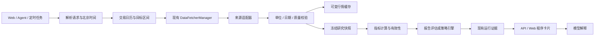

# 数据可信度、北京时间与量化前置层设计

版本：Draft v2，2026-09-14（北京时间）。适用基线：`54ada83` + 当前工作区。本文描述下一批拟实现的契约，不表示所有字段/接口已经存在。

配套计划：[quant-improvement-plan.md](../quant-improvement-plan.md)。已有运行证据：[quant-verifiability-phase1.md](quant-verifiability-phase1.md)。

## 1. 设计目的

建立一条可检查的数据链：请求的时间范围 → 来源选择 → 原始数据及其含义 → 校验与规范化 → 冻结快照 → 确定性指标 → 资格判断 → 执行结果 → Web/模型解释。

需要分别回答：数据是不是本次真的取到的？取自哪里和哪个时间？足不足以计算？单位和复权是否一致？程序有没有运行？某个结果能不能用原输入复现？这些问题不能用一个 `supported`、`coverage_complete` 或“回测成功”布尔值代替。

## 2. 现有模块与拟调整的职责



- `src/time_utils.py`：唯一业务当前时钟和边界序列化工具，支持测试注入。
- `src/core/trading_calendar.py`：市场 session 判断，不承担将缺失日历伪装为已知交易日的职责。
- `src/services/history_loader.py`：统一请求区间与缓存/网络返回门槛。
- `data_provider/`：原始时间解析、单位/复权/端点能力声明、失败分类。
- `src/stock_analyzer.py`：确定性计算与有效性消费，不能根据缺失指标的默认枚举生成交易信号。
- `src/services/stock_service.py` + API schemas：透传证据，不能用服务当前时间代替行情时间。
- `src/repositories/`：可变缓存与不可变快照/执行证据的持久化。
- Web 与 Agent：消费同一结构；模型没有权限将 unknown 提升为 valid。

尽量复用现有类和配置；只有确需持久化的快照身份/任务健康记录新增小型模型，不新增第二套采集系统或调度系统。

## 3. 时间契约

### 3.1 六类时间必须分开

| 字段 | 含义 | 来源 | 表达 |
|---|---|---|---|
| `current_time` / `as_of` | 程序当前观察时刻 | 应用时钟 | ISO8601，含 +08:00 |
| `quote_time` | 报价实际发生/发布时刻 | 数据源 | 有可靠原时区才转换到 +08:00；否则 null |
| `fetched_at` | 成功收到该载荷的时刻 | 采集层 | +08:00；缓存命中不能重写 |
| `served_at` | 本次 API/工具返回时刻 | 服务层 | +08:00；不能用来判断行情新鲜 |
| `session_date` | 所属交易所的交易日标签 | 来源与市场日历 | YYYY-MM-DD，附 market/calendar |
| `period_end` / `published_at` | 财报期末/实际披露时间 | 基本面来源 | 独立字段；不可与抓取时间混用 |

“今天/昨天”一律基于 `current_time` 的北京时间。“上一交易日”必须查询相应市场日历；不能简单减一天。美股的 session_date 仍是交易所交易日，即使它的收盘时刻在北京时间次日。

### 3.2 宿主机与存储

- 核心业务不得直接使用 datetime.now()/date.today() 取无时区当前时刻。
- 超时、耗时、重试间隔使用 monotonic，不受系统时间校正影响。
- 新 API 时间字段携带偏移；Web 统一展示“北京时间”，不依赖浏览器默认时区。
- 现有 SQLite naive DateTime 按既有“北京时间 wall time”兼容契约集中读写；不在各 service 随意 `.replace(tzinfo=...)`。
- 老记录来源不明时标记 `legacy_timezone_unknown`，不猜测按洛杉矶或 UTC 批量迁移。需要迁移时先形成候选报告，用户确认来源后单独执行。
- 原始 epoch 可保留用于核对，但转换后的展示时刻必须与原始值一一对应。

### 3.3 模型时钟

每轮调用替换一个独立的 `[PROGRAM_CLOCK]` 区块，给出北京时间、日期、星期、时区和相对日期规则。工具 `get_current_time` 用于用户直接问日期或长任务中复核时间。

旧聊天内容、新闻正文、工具错误消息不能覆盖程序时钟。提示中包含当前时间是必要条件，但不能保证模型每句都正确，因此程序卡片直接显示实际时间与输入参数，日期敏感结果不能只靠自然语言正文表达。

## 4. 历史请求解析与截止门槛

拟使用内部 `HistoryRequest`，不要求立即破坏当前函数参数：

```json
{
  "instrument": "588000",
  "market": "cn",
  "mode": "date_range",
  "start_date": "2023-09-13",
  "end_date": "2026-09-11",
  "as_of": "2026-09-14T08:00:00+08:00",
  "source_policy": {"mode": "auto", "preferred": []},
  "price_adjustment": "declared_by_provider",
  "purpose": "research"
}
```

以上为结构示例，日期与来源不写死进业务默认值。当前 `days` 调用映射为 `last_n_sessions`，不要将 N=750 自动描述为三个自然年。

处理步骤：

1. 解析标的市场、明确 target_date/frozen date/current time 优先级。
2. 根据目的解析 end_date：盘后研究用最近已完成 session；盘中实时分析可使用有源时间证据的临时 bar。
3. 日历不可用时，展示功能可返回受限数据并标记 calendar_unknown；可信回测资格不通过，不能 fail-open 成“完整”。
4. 将同一 start/end 传给所有来源，包括短窗口。
5. 接收后统一解析日期、排序、去重，拒绝/剔除区间外行并记录数量；无 date 列则不合格。
6. 缓存必须在裁剪去重后评估覆盖，不能拿重复行满足记录数。
7. 网络失败时是否返回缓存由用途决定：展示可返回旧缓存并说明，研究不得静默换成不满足目标区间的数据。
8. 为指标预热可以请求目标区间前的额外数据，但这段仅作为 warmup，不计入收益评估区间；禁止请求后的数据流入历史信号。

元信息至少包括 requested_range、resolved_range、actual_range、expected_sessions、returned_sessions、missing_sessions、excluded_rows、calendar_version、coverage_basis。

## 5. 数据源选择与错误语义

### 5.1 来源能力

每个适配器声明支持的市场/资产类型、history/realtime/fundamental 能力、是否提供源时间、已知价格复权、量单位和缓存行为。能力可以是 unknown，不以数据源名称猜所有端点的语义。

自动模式按已配置优先级和请求能力尝试；完整性不足也属于继续尝试的条件。显式模式只访问用户指定来源，绕过不匹配来源缓存，失败明确返回，不悄悄切换。

不因为两只标的用了不同来源就直接判错；真正需要比较的是日期、市场口径、复权、币种、单位和质量。反过来，同一个 AkShare 名称也不证明底层端点完全一致。

### 5.2 attempts 结构

```json
{
  "provider": "example_provider",
  "endpoint": "daily_history",
  "outcome": "timeout",
  "duration_ms": 1200,
  "returned_rows": 0,
  "retryable": true,
  "error_code": "source_timeout"
}
```

标准 outcome：ok、insufficient、empty、unsupported、timeout、network_error、auth_missing、permission_denied、rate_limited、invalid_payload。只有明确的服务端响应才能区分付费权限/鉴权问题，不能把任意网络错误猜成“需要 API Key”。返回中不包含 Key、带凭证URL或原始异常全文。

沿用现有总预算、单调用 timeout 和 retry 配置，先测量目标部署环境延迟，再调整默认值。当前0.8秒超时过紧是已有证据，但不能简单无限增加等待时间：需保证总预算、有限重试和不会不断积累后台超时线程。超时状态必须是失败/超时，不能是“不支持”。

## 6. 报价元信息和 freshness

报价主数值保留旧字段，拟追加一个统一 `data_quality` 和必要顶层兼容字段：

```json
{
  "stock_code": "588000",
  "current_price": 1.639,
  "quote_time": "2026-09-11T15:00:00+08:00",
  "fetched_at": "2026-09-14T08:00:01+08:00",
  "served_at": "2026-09-14T08:00:02+08:00",
  "session_date": "2026-09-11",
  "timezone": "Asia/Shanghai",
  "volume_unit": "shares",
  "data_quality": {
    "freshness": "last_closed_session",
    "market_phase": "pre_open",
    "calendar_status": "known",
    "eligible_for_intraday_bar": false,
    "reasons": ["latest completed session; not a live intraday quote"]
  }
}
```

这是拟议示例，不代表已有接口已经输出这些字段。

状态由“源时间 + 市场阶段 + 目的”判断：

| 情况 | 建议状态 | 可否合成盘中bar |
|---|---|---|
| 开市阶段、时间在允许滞后内 | recent | 还需通过日期/单位/价格完整性校验 |
| 休市/盘前、属于最近已完成 session | last_closed_session | 否 |
| 明确过旧或缺最新应有 session | stale | 否 |
| 无可靠源时间 | unknown | 否 |
| 超过允许时钟误差的未来时间 | future_timestamp | 否 |

保留现有5分钟逻辑作为兼容参考，但新判断不得用单一秒数代替交易日语义。边界值需要测试和文档；行情有效期与不同接口 SLA 可在后续配置化，避免一次引入大量互斥开关。

### 6.1 字段级来源

若价格来自A、PE来自B，应分别保留 source/quote_time/fetched_at/period_end/validity。补充字段不能继承主报价的“recent”认证。API schema 与 Web 类型必须声明并保留这些字段。

### 6.2 单位、估算与复权

- 成交量统一转换到明确单位后才能比较；个股为股、ETF为份等可以使用清晰的 unit 枚举，不能都凭注释叫“手”。
- 无法确认单位则 unknown；不能通过某个来源名字推测后乘100。
- 成交额缺失为 null；若产品以后需要估算，使用另一个 `estimated_amount` 字段并带算法，不复用真实 amount。
- 日线 close 必须带 adjustment；实时未复权价格与历史复权价格能否拼接需明确规则，未验证不合成。
- source_mixed 只是一种提示；真正的组合门槛是已验证的单位、复权与 session 兼容性。

## 7. 指标有效性与信号资格

每个指标至少表达 `value`、`status`、`required_observations`、`actual_observations`、`reason`、`formula_version`、`input_snapshot_id`。兼容旧接口时保留现有数值字段，追加 `indicator_quality` 字典。

### 7.1 计算规范

| 指标 | 门槛与规则 |
|---|---|
| MA(N) | N 条有效、已规范化且顺序正确的收盘；不以 MA20 替代 MA60 |
| 日线放量倍数 | 当日有效量 + 前5个 session 全部有效量；前5日均量>0；不能用 skipna 对4日取平均 |
| RSI(N) | 明确需N个价格变化，即通常需N+1个有效收盘；输入缺口不映射为0变化；真实完整横盘才为50 |
| MACD | 固定 EMA 参数、初始化与预热策略；遇缺口采用拒绝或重新预热的版本化规则，不能默默跨缺口认证有效 |

现有 RSI 使用简单均值定义，先保持并明确标注，不在 bug 修复中偷偷换另一种平滑公式。公式改变必须新版本并重新生成评估基线。

原始输入 NaN、Infinity、负量、非正价格、重复日期、未来日期都必须在校验层处理。最终 finite 是必要条件，不是输入完整性的充分条件。

### 7.2 评分

默认策略明确 required indicators；缺失 required 指标时 `signal_status=insufficient_data`，`actionable=false`，`buy_signal` 不得为BUY/STRONG_BUY。可以展示有效指标供用户研究。

若保留探索性分数，应标记 `score_status=partial` 并列出有效权重和缺失原因，不能用正常总分阈值生成交易建议；默认第一版优先不输出可执行分数，减少误用。

维护 `data_quality_issues` 与 `strategy_risks` 两个概念，最终合并展示但不相互覆盖；旧 `risk_factors` 可由两者去重构造。不能在 `_generate_signal` 初始化空列表后覆盖已有缺失证据。

## 8. 冻结快照与运行记录

保留 StockDaily 的在线缓存角色，阶段1.1拟追加 `market_data_snapshots` 或等价仓储：

| 字段 | 用途 |
|---|---|
| snapshot_id / schema_version | 快照身份及结构版本 |
| instrument / market / interval | 标的和bar类型 |
| request_json / resolved_range | 用户请求与程序解析结果 |
| price_adjustment / currency / volume_unit | 口径 |
| source_metadata / attempts | 来源及路径 |
| calendar_version / quality_json | 覆盖与有效性证据 |
| payload / payload_hash | 冻结输入及稳定序列化校验 |
| created_at / observed_at | 北京时间记录 |

第一版可继续用SQLite JSON/Text存储有限日频标的，明确体积预算和导出，不预先引入对象存储或分布式数据库。快照一旦被运行引用，不原地修改或自动删除。

`backtest_runs` 追加 snapshot_id、data_quality_status、input_eligibility、engine_kind、engine_version。execution_status=completed 只说明程序执行完，不表示数据可用于交易或收益有效。报告评估可能允许 unknown 输入，但必须显式标记探索性质；默认策略引擎拒绝不合格输入。

后续可增加引擎/依赖指纹与重放命令。哈希证明内容匹配，不证明上游真实，也不是防管理员修改的数字签名。

## 9. API 和用户交互（拟议变更）

优先扩展现有 `GET /api/v1/stocks/{code}/quote` 和 history 响应，保证来源与时间信息贯通；不要创建一个只有新页面能用的平行报价API。

| 入口 | 本轮设计 |
|---|---|
| 股票报价 API | 追加 quote_time/fetched_at/served_at/session_date/units/data_quality/field_sources |
| 历史工具与 API | 一致的 resolved range、coverage、snapshot_id |
| 指标工具 | 追加 indicator_quality、signal_status、actionable |
| 现有回测运行查询 | 追加数据资格和引用快照，保留原字段 |
| 数据诊断 | 后续新增只读查询接口前，先复用运行诊断模型；路径待实现时确定，不在文档中假装已有 |

Web卡片分成：数据时效、区间覆盖、指标可用性、程序运行结果。正文为AI解释。未知时间显示“源未提供时间”，旧收盘显示“最近交易日收盘”，请求失败显示实际原因，不能只显示一个绿色“实时”标记。

自然语言中的“今天”“三年”“实时”需先解析为明确参数并展示。没有通过数据资格的结果允许解释缺口，不输出虚构数字或用旧区间代替新请求。

## 10. 每日执行与可用性证据

复用 Scheduler，持久化一个轻量 `data_check_runs`/现有任务扩展记录，至少包含：run_id、计划时刻、实际开始结束时刻、市场阶段、目标session、代码、来源attempts、覆盖、质量、结论、镜像版本。

日频任务幂等键建议由 job_type、instrument、target_session、policy_version 组成；重试可有不同attempt，但不重复写最终结果。启动立即执行与定时触发共用幂等处理。

场景：

- 盘前：验证最近已完成session及来源连通性；没有今日bar正常。
- 盘中：验证有时间戳的报价，检查滞后与单位；unknown不能强行合成。
- 盘后：在合理到达延迟之后检查当日完整日线；未到数据记pending/insufficient，有限重试。
- 非交易日：预期最近交易日收盘，不产生假缺失，也不假装实时交易。
- 重启/中断：保留中断证据，按幂等键恢复；不将没有终态的running当成功。

后续统计成功率、延迟分位数、缺失率和切源次数，但必须记录观察样本与市场阶段。不能以单次在线成功给出“每天一定能拿到真实数据”的承诺。

## 11. 测试矩阵和验收

| 维度 | 必须覆盖 |
|---|---|
| 时间 | 固定UTC瞬间下的UTC/上海/洛杉矶宿主；北京时间23:59→00:01；美国夏令时；旧naive时间 |
| session | 盘前/盘中/盘后/周末/长假/日历不可用 |
| 历史请求 | 30/60/750日；明确区间；缓存/网络；指定/自动来源；未来行/重复行 |
| 指标 | 完整黄金样本、窗口不足、内部NaN、零分母、全部零量、不同单位/复权 |
| 报价 | 新鲜/旧/无时间/未来时间；主源与补充源时间不同；缓存时刻不重写 |
| API/Web | null与quality字段保留；明确+08:00；stale不变成当前更新时间；原客户端兼容 |
| 执行 | 重试/重复触发/进程中断/数据库写失败；快照重放一致 |
| Docker | Linux UID差异、只写临时卷、服务重启、静态资源、同一digest |

测试分层：单元/确定性集成作为阻断门禁；Docker服务烟测独立；真实网络观测独立并带环境/时间证据；目标服务器的在线验收不能用本地mock代替。

## 12. 实施与回滚

顺序遵循计划WP1–WP5。字段先追加并在所有消费者接入后再考虑收敛旧字段。数据快照和运行证据不删除；旧镜像与数据库备份保留。时区不明历史迁移、实盘接入、策略参数优化、批量历史重算属于后续独立操作，不包含在本设计默认执行范围。

公开使用说明中英文同步；详细内部设计按用户要求用中文维护。每个WP结束更新状态、测试证据与兼容性，不在CHANGELOG提前写“已实现”。
