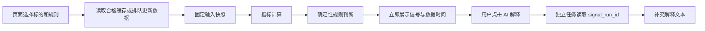

# 简易量化信号与低延迟设计

状态：待实现设计；基线 `f0abe52`，2026-09-14 北京时间。按用户最新要求，本阶段不做 portfolio、账户、持仓或组合回测。既有相关模块保留，本设计不修改其行为。

## 1. 产品目标

用户选择标的与规则，立即看到由程序计算的指标、规则是否满足、数据日期和不足原因。大模型只承担可选解释及低频规则配置辅助，不负责逐次计算指标、不生成事实、不参与信号是否成立的判断。

第一版提供日线规则扫描、单标的历史信号事件复查、已有价格回报展示。历史信号复查只评估事件后的价格变化，不计算资金、成交、账户或净值。`daily_return` 是标的价格变化基线，不是规则有效性的证明。

## 2. 当前链路与延迟判断

`src/core/pipeline.py` 初始化分析器后串接行情、技术分析、新闻及 LLM；设置 agent_skills 还可能自动进入 Agent。`src/agent/runner.py` 的通用循环支持多次模型往返。仅关闭 agent_mode 仍可能走 GeminiAnalyzer 的模型分析，不能作为无模型快速入口。

本次对现有 StockTrendAnalyzer 做 50 次、每次 750 行的暖运行微基准：p50 **2.90ms**、p95 **3.48ms**。数据为内存合成 OHLCV；不含网络、SQL、HTTP、冷启动或并发。这证明指标计算本身有条件很快，不能据此承诺线上接口只需几毫秒。

当前没有真实 LLM 调用的分段耗时，不能断言慢完全来自模型。先采集 data_wait、normalize、snapshot、indicator、rule、serialize、queue_wait、llm_first_token、llm_total；使用 monotonic 计时，北京时间仅用于业务时间戳。

## 3. 两条独立请求路径

快路径不能调用现有完整 AnalysisPipeline 或 Agent；在服务层复用 history_loader、数据源 manager、StockTrendAnalyzer、快照仓储和时钟模块。数据未准备好时返回 accepted 状态及任务编号，不能让浏览器长时间等待整个外部 fallback。

慢路径默认不开启。收到解释请求后只读已固定 signal_run，不再次抓行情、跑规则或查新闻；新闻深度研究继续放在现有完整分析入口。解释超时/失败不影响程序信号，解释也不能覆盖数值字段。

## 4. 第一条规则规格

首个内置规则 `ma_trend_v1`：均线趋势观察。它是工程验收样例，不代表收益建议；参数作为版本化默认值，可在有限范围内编辑。

- 输入：一个标的，已完成交易日 T 的合格日线，至少 60 个可验证交易日；不拼接当日未收盘 K 线。
- 必需指标：SMA5、SMA20、SMA60、当日成交量 / 前五个有效交易日平均成交量。
- 条件：close[T] > SMA20[T]；SMA5[T] > SMA20[T]；SMA20[T] > SMA60[T]；1 <= volume_ratio_5d[T] <= 3。
- 四项全部为 true 时 matched；必需值未知时 blocked；至少一项确定 false 且其余数据有效时 not_matched。
- 日频成交量比明确命名为 volume_ratio_5d，不冒充供应商盘中量比；供应商实时 volume_ratio 单独展示来源及定义状态。
- matched 是“条件满足”，不直接称为买入指令。无效数据不能用 false 或“持有”掩盖。

规则层只支持白名单指标与 gt/gte/lt/lte/crosses_above/and 等有限操作；第一版固定模板优先，不做通用语言。参数须校验窗口大小、数值范围、预热长度与最大标的数。禁止执行用户或模型生成的 Python、SQL、eval 字符串。

StockTrendAnalyzer 中既有综合评分只作为独立指标输出；本规则不强制依赖它的所有 REQUIRED_INDICATORS。规则必须自己声明依赖，避免不使用 MACD 的规则被 MACD 缺失阻断。优先复用现有计算结果；新增指标计算函数时应集中复用，不能在 API 和 Agent 各写一套公式。

## 5. 输入、交易日与质量

冻结的 evaluation_start/end 与 warmup_start 明确区分。规则在 T 时只读日期 <= T 的数据；预热行可用于指标，不计为评估事件。历史逐日计算须证明一次向量计算结果与逐日截断计算一致。

所有消费行必须在声明区间内；保留区间外行作预热时，必须明确其角色。当前快照可保留范围外 payload，daily_return 又会全部消费，必须先修复。

对 A 股股票/ETF，必需价格必须有限且 >0，成交量有限且 >=0；零成交量不能自动认定可交易。验证日期唯一、交易所 session 集合、OHLC 关系、复权及单位口径。`provider_default` 仅是供应商默认口径标签，未经 adapter 明确映射不等于已知复权。

当前覆盖校验允许 10% session 赤字，不足以支持“连续日频收益/严格规则”资格。研究展示可以 partial；规则依赖窗口有 session 缺口时 blocked。日历不可用时不能因为首尾齐全升级严格资格。资格按用途区分 display、indicator、signal、return，不能共享一个布尔值覆盖所有场景。

持久化时间统一带 +08:00；session_date 仍按交易所日历。盘前与周末正常使用最近已收盘交易日，显示“截至某交易日”；盘中报价独立标注 quote_time，不能改变已完成日线规则的 session_date。数据源切换或复权变化必须生成新快照，禁止拼接未知口径。

## 6. 服务、接口与持久化（均为拟新增）

| 位置 | 职责 |
|---|---|
| src/services/quant_signal_service.py | 输入解析、质量门槛、计算与运行记录；不引用 LLM 工厂 |
| src/core/quant_rules.py | 内置版本化规则与纯函数判断，返回各条件证据 |
| src/repositories/signal_run_repo.py | 保存确定性结果；复用现有 DB/session 约定 |
| api/v1/endpoints/quant.py | 规则清单、运行/查询、刷新任务和解释请求 |
| apps/dsa-web | 快速信号卡片、规则参数与独立解释区 |

不直接把信号记录塞进现有 backtest evidence.items：旧报告与 daily_return 已出现异构结构兼容问题。复用其稳定序列化/哈希约定，新增 signal_runs 存储不可变结果，任务状态沿用项目现有任务服务；需要确认其执行器支持独立 handler，不能为复用而进入模型流水线。

拟定接口：

- GET /api/v1/quant/rules：固定规则、版本和允许参数。
- POST /api/v1/quant/runs：code、rule_id、parameters、as_of_session、data_mode=closed_daily、可选 snapshot_id。就绪返回 200 结果；需更新返回 202 job_id；参数非法 422。
- GET /api/v1/quant/runs/{id}：结果；GET /api/v1/quant/jobs/{id}：排队/运行/失败状态。
- POST /api/v1/quant/runs/{id}/explanation：显式触发，返回解释或独立 job_id。

这些路径尚不存在，不要在文档使用说明中当作已上线接口。默认沿用现有认证，不增加公开匿名入口。

signal_run 最少字段：run_id、schema_version、rule_id/version、parameters、instrument、session_date、computed_at、snapshot_id/payload_hash、quality_policy_version、indicator_version、signal_status、conditions、indicators、blocked_reasons、timings、result_hash。

每个 condition 保存 indicator/operator/threshold/actual/status，而不是只有一段文字。解释用模板即可输出“MA5 为 X，高于 MA20 的 Y，条件满足”；模板及程序数值足以完成默认页面。

解释单独保存 explanation_status、signal_run_id、model_config_fingerprint、prompt_version、text、generated_at；失败可以重试，但不更新原始 signal_run。

## 7. 缓存、并发与时延预算

三层缓存：行情缓存按 source/adjustment/session 隔离；指标缓存按 snapshot_hash + indicator_version + window；规则结果按 snapshot_hash + rule_version + canonical_parameters + quality_policy_version。缓存命中仍检查预期交易日，不允许用 TTL 证明当日数据已到齐。

日线收盘后预计算关注标的；首次打开读已有结果。新数据修订后新建快照并失效下游缓存，历史运行不覆盖。相同 cache key 的并发请求合并一次任务，数据库唯一键保证多 worker 幂等，不只依赖内存锁。

设计预算（待目标服务器压测，不是当前承诺）：

| 场景 | 目标 |
|---|---|
| 缓存命中：API 返回已有信号 | p95 <=300ms |
| 已有合格快照：单标的750行重新计算 | p95 <=500ms，含 DB/HTTP |
| 无数据：接受后台任务 | <=500ms 返回 job_id |
| 外部数据刷新 | 独立总预算，建议首版15s；到期显式失败/partial |
| AI 解释 | 独立30s预算；不影响以上路径 |

首版多标的使用有界队列，建议最多20标的/请求、4个计算任务并发，外部源并发限制更低；这些是设计起点，压测后定值。超时必须传递到 HTTP/socket 层；Future 超时不等于底层线程取消。持续阻塞的数据源必要时隔离 worker，不允许遗留无限线程。新配置项实施时同步 .env.example。

LLM 优化顺序：先取消默认调用，再减少上下文和工具往返、缓存解释、按需单次生成，最后才基于实测比较模型配置。流式输出改善首字体验，却不会让规则计算更快。不要把切换“更快模型”作为事实计算的依赖。

## 8. 历史信号评估，不做 portfolio

按固定规则版本逐日回放信号；对每个事件记录 T、当日条件和其后 1/5/10 个交易日价格变化。首版清楚命名为 event_forward_return：close[T+h]/close[T]-1，仅描述事件后变化，不代表 T 收盘可成交的收益。

相邻满足日用 first_match（false→true）或 every_match，策略参数中明确并记录；默认 first_match 减少重叠，但汇总仍提示样本重叠和相关性。样本不足、末尾未成熟、停牌缺口分别标识，不补值。汇总样本数、中位数、分位数、上涨比例及同区间全部可用日期基线；不用“胜率”暗示真实交易盈利。

参数开发区间和留出评估区间分开；禁止用后续日期为 T 补缺数据或挑选最佳参数后只报告同样本结果。不同复权策略须显式记录，跨红利拆分的“总回报”不能仅凭原始收盘比值命名。

## 9. 验收与发布顺序

1. 先修当前 review 的区间、前端证据类型、零价格状态；明确 daily_return 服务/API 边界。
2. 新快速接口在没有任何模型 Key、并将所有模型调用替换为抛错函数时仍完整返回结果。
3. 固定小样本手算 MA/量比/规则真值；null、NaN、重复、缺 session、来源混用全部负例。
4. 同快照同规则结果一致；未来 bars 增加不改变历史 T 的信号；不同规则版本不共用结果缓存。
5. 真实浏览器验证先显示信号，解释按钮异步补充；解释超时不清空或修改信号。
6. Docker 在目标服务器记录冷/暖启动、单标的/20标的、并发、慢源、断网、跨北京时间日期的 p50/p95；独立验收真实源时间与抓取时间。

每步小改动交付；旧报告入口保留兼容。第一版不要求 Redis、新消息中间件或更换模型供应商。发布先使用手动快速扫描，再启用盘后预计算。回滚时停用新入口/任务，保留历史记录和旧分析入口，不删除用户数据。

## 10. UI 入口与交互补充

在现有 Web 侧栏增加“量化信号”，拟定路由 /quant；沿用现有登录、同一后端和 Docker 端口。独立的是页面与服务调用路径，不要求另开网络监听端口。当前 App.tsx 与 SidebarNav.tsx 已有页面/导航模式，实施时复用。

页面布局：顶部为标的选择、规则模板及参数；中部为结果列表（条件满足/未满足/数据不足），显示截至交易日、来源、计算时间；侧面或展开区呈现 MA、日频量比、逐项条件与历史事件。默认模板解释即可读懂，AI 解释为独立按钮和独立加载状态。

必须区分三个操作：“运行规则”使用现有输入快照；“更新行情”提交受限的数据刷新任务；“AI解释”读取已有结果。改规则参数、切标签或重复点击运行不能自动重复访问供应商。刷新中继续展示旧结果及明确日期，新结果就绪后替换；不可把旧数据的时间改成现在。

数据状态展示：缓存可用、更新中、等待数据源、请求过频已暂停、需要配置权限、数据不完整。页面可显示冷却剩余时间，不能提供绕过后台限流的“强制刷新”。不得仅凭超时显示“IP被封”。

## 11. 数据源请求预算与限流保护

访问量过大会被供应商限流或拒绝，请求限制可能按IP、API Key、账号或接口计数。AkShare是从上游公开网站采集数据的库，不是一个统一配额的服务器；官方答疑在ReadTimeout场景建议降低访问频率。参见 [项目说明](https://akshare.akfamily.xyz/introduction.html)、[官方答疑](https://akshare.akfamily.xyz/answer.html)。Polygon官方客户端也说明免费层有使用限制并可能返回限流错误，具体预算按当前账号套餐确认：[官方客户端](https://github.com/polygon-io/client-php)。查询日期2026-09-14；不以某个“安全每秒请求数”保证不封禁。

设计要求：

- 集中由后端访问供应商，UI只访问本项目。规则计算与行情采集分离，多次计算不产生多次采集。
- 按真实上游域名/接口族及凭据身份共享预算；AkShare、Efinance等不同adapter若访问同一上游，必须共用限流器。多容器共用出口IP时也不能各自独立使用全额配额。
- 优先缓存及官方批量端点。历史首次拉取后增量更新并处理修订；日线默认盘后更新，盘中重跑日线规则读快照。实时面板按独立预算更新，页面不可见时停止无必要轮询。
- 429尊重Retry-After（秒数或HTTP日期），无提示时有界指数退避加抖动；重试也计入总预算。连续失败熔断并保存retry_at，避免浏览器重试与后端重试叠加。
- 401/明确权限不足不重复重试，提示配置；403保存分类，暂停排查而不直接断言封IP。超时、5xx与解析失败分别记录。备用源需独立授权、预算及口径验证，不能无限轮换来源形成请求风暴。
- 一个请求的外层deadline必须覆盖排队、fallback和重试；到期返回明确状态。首次建议每真实上游并发1并设有限请求预算，最终值按公开限制/套餐及低负载观测确定；不承诺任何固定速率永不被封。
- 日志记录源、endpoint族、耗时、状态码、重试、缓存命中和冷却，不记录API Key。设置请求数/限流次数/缓存命中率观测；不要通过故意压到封禁来验证阈值。

现有代码有失败分类和部分专用熔断，不等于已经具备上述跨页面、任务和adapter共享预算。验收须覆盖同标的重复点击仅一次抓取、多个adapter同域名共享预算、429后无重试风暴、重启后不立即突破冷却、改参数不联网、断网仍展示带日期的已有结果。本文为UI和保护设计补充，尚未实现。
